# Arcade CI/CD 平台架构设计与文档重构

## 项目概述

**项目名称**: Arcade CI/CD 平台  
**项目描述**: 基于 gRPC 的分布式 CI/CD 平台，支持插件化扩展和智能任务调度  
**目标用户**: DevOps 工程师、开发团队、运维团队  
**核心问题**: 提供统一的 CI/CD 解决方案，支持多环境、多地域的任务执行和流水线管理  
**成功指标**: 任务执行成功率 > 99%，平均任务执行时间 < 5分钟，支持 1000+ 并发任务

## 系统架构设计

### 架构图

```mermaid
graph TB
    subgraph "Client Layer"
        UI[Web UI]
        CLI[CLI Client]
        API[REST API Client]
    end
    
    subgraph "Arcade Server"
        subgraph "API Layer"
            HTTP[HTTP Server<br/>Fiber v2]
            GRPC[gRPC Server<br/>Port 9090]
            WS[WebSocket<br/>Real-time Updates]
        end
        
        subgraph "Core Services"
            PS[Pipeline Service]
            AS[Agent Service]
            TS[Task Service]
            SS[Storage Service]
            AUTH[Auth Service]
        end
        
        subgraph "Plugin System"
            PM[Plugin Manager]
            PH[Plugin Handlers]
            PC[Plugin Cache]
        end
        
        subgraph "Data Layer"
            MYSQL[(MySQL<br/>Metadata)]
            MONGO[(MongoDB<br/>Logs/Events)]
            REDIS[(Redis<br/>Cache/Session)]
        end
        
        subgraph "Storage Layer"
            S3[S3 Compatible<br/>Artifacts]
            MINIO[MinIO]
            GCS[Google Cloud Storage]
        end
    end
    
    subgraph "Agent Layer"
        subgraph "Agent 1"
            A1[Agent Process]
            A1P[Local Plugins]
            A1L[Label: env=prod]
        end
        
        subgraph "Agent 2"
            A2[Agent Process]
            A2P[Local Plugins]
            A2L[Label: env=staging]
        end
        
        subgraph "Agent N"
            AN[Agent Process]
            ANP[Local Plugins]
            ANL[Label: region=us-west]
        end
    end
    
    subgraph "External Systems"
        GIT[Git Repository]
        REGISTRY[Docker Registry]
        NOTIFY[Notification<br/>Slack/Email]
    end
    
    %% Client connections
    UI --> HTTP
    CLI --> GRPC
    API --> HTTP
    
    %% Server internal connections
    HTTP --> PS
    HTTP --> AS
    HTTP --> TS
    GRPC --> AS
    GRPC --> TS
    GRPC --> PS
    
    %% Service connections
    PS --> PM
    AS --> PM
    TS --> PM
    
    %% Data connections
    PS --> MYSQL
    AS --> MYSQL
    TS --> MYSQL
    PS --> MONGO
    AS --> REDIS
    TS --> REDIS
    
    %% Storage connections
    TS --> S3
    TS --> MINIO
    TS --> GCS
    
    %% Agent connections
    AS -.->|gRPC| A1
    AS -.->|gRPC| A2
    AS -.->|gRPC| AN
    
    %% External connections
    PS --> GIT
    TS --> REGISTRY
    PS --> NOTIFY
    
    %% Plugin connections
    PM --> PC
    PM --> PH
    A1P -.->|Download| PC
    A2P -.->|Download| PC
    ANP -.->|Download| PC
```



### 核心组件分析

#### 1. Arcade Server (主服务)

**技术栈**:
- **语言**: Go 1.24.0
- **Web框架**: Fiber v2 (高性能 HTTP 框架)
- **gRPC**: Google gRPC v1.76.0
- **数据库**: MySQL (GORM) + MongoDB + Redis
- **依赖注入**: Google Wire
- **配置管理**: Viper
- **日志**: Zap

**核心功能**:
- **任务调度**: 基于标签选择器的智能任务分发
- **流水线管理**: 支持多阶段、依赖关系的流水线编排
- **插件管理**: 基于 HashiCorp go-plugin 的插件系统
- **实时通信**: WebSocket 和 gRPC 双向流
- **存储管理**: 支持多种对象存储后端

#### 2. Arcade Agent (执行代理)

**技术栈**:
- **语言**: Go 1.24.4
- **通信**: gRPC Client
- **配置**: Viper + TOML

**核心功能**:
- **任务执行**: 接收并执行来自 Server 的任务
- **状态上报**: 实时上报任务执行状态和日志
- **插件支持**: 动态下载和执行插件
- **标签管理**: 动态更新 Agent 标签

#### 3. 插件系统

**架构特点**:
- **热加载**: 支持插件动态加载和卸载
- **自动监控**: 文件系统监控，自动发现新插件
- **RPC通信**: 基于 net/rpc 的进程间通信
- **日志捕获**: 插件 stdout/stderr 自动捕获
- **健康检查**: 定期心跳检测插件状态

**插件类型**:
- **CI插件**: 构建、测试、代码检查
- **CD插件**: 部署、回滚
- **Security插件**: 安全扫描、审计
- **Notify插件**: 消息通知
- **Storage插件**: 存储管理
- **Custom插件**: 自定义功能

## 数据模型设计

### 核心实体关系

```mermaid
erDiagram
    Organization ||--o{ Project : contains
    Project ||--o{ Pipeline : defines
    Pipeline ||--o{ PipelineRun : executes
    PipelineRun ||--o{ Task : contains
    Task ||--o{ TaskLog : generates
    Task ||--o{ Artifact : produces
    
    Agent ||--o{ Task : executes
    Agent {
        string agent_id PK
        string hostname
        string ip
        string os
        string arch
        string version
        int32 max_concurrent_jobs
        map labels
        enum status
        timestamp created_at
        timestamp updated_at
    }
    
    Pipeline {
        string pipeline_id PK
        string name
        string description
        string repo_url
        string branch
        repeated Stage stages
        map env
        enum trigger_type
        string cron
        string created_by
        timestamp created_at
        timestamp updated_at
    }
    
    Task {
        string task_id PK
        string job_id FK
        string pipeline_id FK
        string agent_id FK
        string name
        int32 stage
        repeated string commands
        map env
        string workspace
        int32 timeout
        string image
        map secrets
        repeated Artifact artifacts
        LabelSelector label_selector
        repeated PluginInfo plugins
        enum status
        int32 exit_code
        string error_message
        timestamp start_time
        timestamp end_time
    }
    
    Plugin {
        string plugin_id PK
        string name
        string type
        string version
        string checksum
        int64 size
        string download_url
        enum location
        timestamp created_at
        timestamp updated_at
    }
```

## API 设计

### gRPC 服务接口

#### 1. Agent Service (`api/agent/v1/agent.proto`)

**核心方法**:
- `Register`: Agent 注册
- `Heartbeat`: 心跳保持
- `FetchTask`: 拉取任务
- `ReportTaskStatus`: 上报状态
- `ReportTaskLog`: 上报日志
- `CancelTask`: 取消任务
- `UpdateLabels`: 更新标签
- `DownloadPlugin`: 下载插件

#### 2. Pipeline Service (`api/pipeline/v1/pipeline.proto`)

**核心方法**:
- `CreatePipeline`: 创建流水线
- `GetPipeline`: 获取流水线
- `ListPipelines`: 列出流水线
- `TriggerPipeline`: 触发执行
- `StopPipeline`: 停止流水线

#### 3. Task Service (`api/task/v1/task.proto`)

**核心方法**:
- `CreateTask`: 创建任务
- `GetTask`: 获取任务
- `ListTasks`: 列出任务
- `UpdateTask`: 更新任务
- `CancelTask`: 取消任务
- `GetTaskLog`: 获取日志

### REST API 设计

**基础路径**: `/api/v1`

**核心端点**:
- `GET /health`: 健康检查
- `GET /version`: 版本信息
- `POST /auth/login`: 用户登录
- `GET /pipelines`: 流水线列表
- `POST /pipelines`: 创建流水线
- `GET /pipelines/{id}`: 获取流水线详情
- `POST /pipelines/{id}/trigger`: 触发流水线
- `GET /agents`: Agent 列表
- `GET /tasks`: 任务列表
- `GET /plugins`: 插件列表

## 标签选择器系统

### 标签匹配机制

Arcade 使用强大的标签选择器实现任务到 Agent 的智能路由：

#### 1. 精确匹配 (match_labels)
```protobuf
label_selector {
  match_labels {
    "env": "production",
    "region": "us-west"
  }
}
```

#### 2. 表达式匹配 (match_expressions)
支持 6 种操作符：
- `IN`: 标签值在列表中
- `NOT_IN`: 标签值不在列表中  
- `EXISTS`: 标签 key 存在
- `NOT_EXISTS`: 标签 key 不存在
- `GT`: 标签值大于指定值
- `LT`: 标签值小于指定值

#### 3. 使用场景
- **环境隔离**: `env=production`, `env=staging`, `env=dev`
- **地域分布**: `region=us-west`, `region=cn-north`
- **硬件能力**: `gpu=true`, `cpu=high-performance`
- **专用任务**: `build=android`, `deploy=kubernetes`
- **版本控制**: `agent-version=v1.2.0`

## 通信流程设计

### Agent 启动流程
```
1. Agent -> Server: Register (注册)
2. Server -> Agent: RegisterResponse (返回 Agent ID 和配置)
3. Agent -> Server: Heartbeat (定期心跳)
4. Agent -> Server: FetchTask (拉取任务)
5. Server -> Agent: FetchTaskResponse (返回待执行任务)
```

### 任务执行流程
```
1. Agent 收到任务
2. Agent -> Server: ReportTaskStatus (RUNNING)
3. Agent -> Server: ReportTaskLog (流式上报日志)
4. Agent 执行任务
5. Agent -> Server: ReportTaskStatus (SUCCESS/FAILED)
```

### 流水线触发流程
```
1. Client -> Server: TriggerPipeline
2. Server 创建流水线任务
3. Agent -> Server: FetchTask (拉取任务)
4. Client -> Server: StreamPipelineStatus (监控流水线状态)
5. Server -> Client: 流式推送状态变化
```

## 配置管理

### Server 配置 (`conf.d/config.toml`)

**核心配置项**:
- **日志配置**: 支持 stdout、file、kafka 输出
- **gRPC配置**: 端口 9090，最大连接数 1000
- **HTTP配置**: 端口 8080，支持 CORS、pprof
- **数据库配置**: MySQL + MongoDB + Redis
- **任务配置**: Worker 池配置
- **插件配置**: 插件缓存目录

### Agent 配置 (`conf.d/config.toml`)

**核心配置项**:
- **服务器地址**: gRPC 服务器连接地址
- **Agent标签**: 环境、地域等标签配置
- **心跳间隔**: 默认 60 秒
- **日志配置**: 与 Server 类似的日志配置

## 优化建议

### 1. 架构优化

#### 1.1 微服务拆分
**现状**: 单体架构，所有服务在同一个进程中
**建议**: 考虑按业务域拆分为独立服务
- **Pipeline Service**: 流水线管理
- **Task Service**: 任务调度和执行
- **Agent Service**: Agent 管理
- **Plugin Service**: 插件管理
- **Storage Service**: 存储管理

#### 1.2 消息队列集成
**现状**: 使用 Redis 作为缓存和会话存储
**建议**: 引入消息队列 (如 RabbitMQ、Apache Kafka)
- **任务队列**: 异步任务处理
- **事件总线**: 系统事件发布订阅
- **日志收集**: 集中式日志处理

#### 1.3 服务发现
**现状**: Agent 硬编码连接 Server 地址
**建议**: 引入服务发现机制
- **Consul**: 服务注册与发现
- **etcd**: 分布式配置管理
- **健康检查**: 自动故障转移

### 2. 性能优化

#### 2.1 数据库优化
**现状**: 使用 GORM 进行数据库操作
**建议**:
- **连接池优化**: 调整最大连接数和空闲连接数
- **读写分离**: 主从数据库架构
- **分库分表**: 按项目或时间分片
- **索引优化**: 为常用查询字段添加索引

#### 2.2 缓存策略
**现状**: Redis 主要用于会话存储
**建议**:
- **多级缓存**: L1(内存) + L2(Redis) + L3(数据库)
- **缓存预热**: 系统启动时预加载热点数据
- **缓存更新**: 基于事件的缓存失效策略

#### 2.3 任务调度优化
**现状**: 基于标签的简单匹配
**建议**:
- **负载均衡**: 考虑 Agent 负载和资源使用率
- **任务优先级**: 支持任务优先级队列
- **资源预留**: 为高优先级任务预留资源

### 3. 可靠性优化

#### 3.1 容错机制
**现状**: 基本的错误处理和重试
**建议**:
- **熔断器**: 防止级联故障
- **重试策略**: 指数退避重试
- **超时控制**: 合理的超时设置
- **优雅降级**: 服务降级策略

#### 3.2 监控告警
**现状**: 基本的日志记录
**建议**:
- **指标收集**: Prometheus + Grafana
- **链路追踪**: Jaeger 或 Zipkin
- **日志聚合**: ELK Stack
- **告警机制**: 基于阈值的自动告警

#### 3.3 数据备份
**现状**: 依赖数据库自身的备份机制
**建议**:
- **定期备份**: 自动化备份策略
- **增量备份**: 减少备份时间和存储
- **跨地域备份**: 灾难恢复准备
- **备份验证**: 定期恢复测试

### 4. 安全优化

#### 4.1 认证授权
**现状**: JWT 基础认证
**建议**:
- **RBAC**: 基于角色的访问控制
- **OAuth2/OIDC**: 企业级身份认证
- **API 密钥**: 服务间认证
- **审计日志**: 操作审计追踪

#### 4.2 数据安全
**现状**: 基础的数据存储
**建议**:
- **数据加密**: 敏感数据加密存储
- **传输加密**: TLS/SSL 加密传输
- **密钥管理**: 集中式密钥管理
- **数据脱敏**: 日志和调试信息脱敏

### 5. 可扩展性优化

#### 5.1 水平扩展
**现状**: 单机部署
**建议**:
- **无状态设计**: 服务无状态化
- **负载均衡**: 多实例负载均衡
- **数据分片**: 数据库水平分片
- **CDN**: 静态资源 CDN 加速

#### 5.2 插件生态
**现状**: 基础插件系统
**建议**:
- **插件市场**: 官方和第三方插件市场
- **插件认证**: 插件安全认证机制
- **版本管理**: 插件版本兼容性管理
- **文档生成**: 自动生成插件文档

## 部署架构建议

### 1. 容器化部署

**Docker 化**:
```dockerfile
# 多阶段构建
FROM golang:1.24-alpine AS builder
WORKDIR /app
COPY . .
RUN go build -o arcade cmd/arcade/main.go

FROM alpine:latest
RUN apk --no-cache add ca-certificates
WORKDIR /root/
COPY --from=builder /app/arcade .
CMD ["./arcade"]
```

**Kubernetes 部署**:
- **Deployment**: 无状态服务部署
- **Service**: 服务发现和负载均衡
- **ConfigMap**: 配置管理
- **Secret**: 敏感信息管理
- **Ingress**: 外部访问控制

### 2. CI/CD 流水线

**GitHub Actions 示例**:
```yaml
name: Arcade CI/CD
on: [push, pull_request]
jobs:
  test:
    runs-on: ubuntu-latest
    steps:
      - uses: actions/checkout@v3
      - uses: actions/setup-go@v3
        with:
          go-version: 1.24
      - run: go test ./...
      - run: go build ./cmd/arcade
```

### 3. 监控运维

**Prometheus 指标**:
- **业务指标**: 任务执行成功率、平均执行时间
- **系统指标**: CPU、内存、磁盘使用率
- **应用指标**: HTTP 请求数、gRPC 调用数

**Grafana 仪表板**:
- **系统概览**: 整体系统状态
- **任务监控**: 任务执行情况
- **Agent 状态**: Agent 健康状态
- **性能分析**: 性能指标趋势

## 总结

Arcade CI/CD 平台是一个设计良好的分布式系统，具有以下优势：

1. **现代化技术栈**: 使用 Go、gRPC、Fiber 等现代技术
2. **插件化架构**: 基于 HashiCorp go-plugin 的可扩展插件系统
3. **智能调度**: 基于标签选择器的任务路由机制
4. **实时通信**: WebSocket 和 gRPC 双向流支持
5. **多存储支持**: 支持多种对象存储后端

**主要改进方向**:
1. **微服务化**: 从单体架构向微服务架构演进
2. **云原生**: 容器化和 Kubernetes 部署
3. **可观测性**: 完善的监控、日志、链路追踪
4. **安全性**: 企业级安全认证和授权
5. **生态建设**: 插件市场和社区建设

通过以上优化建议的实施，Arcade 平台将能够更好地支持大规模、高并发的 CI/CD 场景，为企业提供稳定可靠的 DevOps 解决方案。