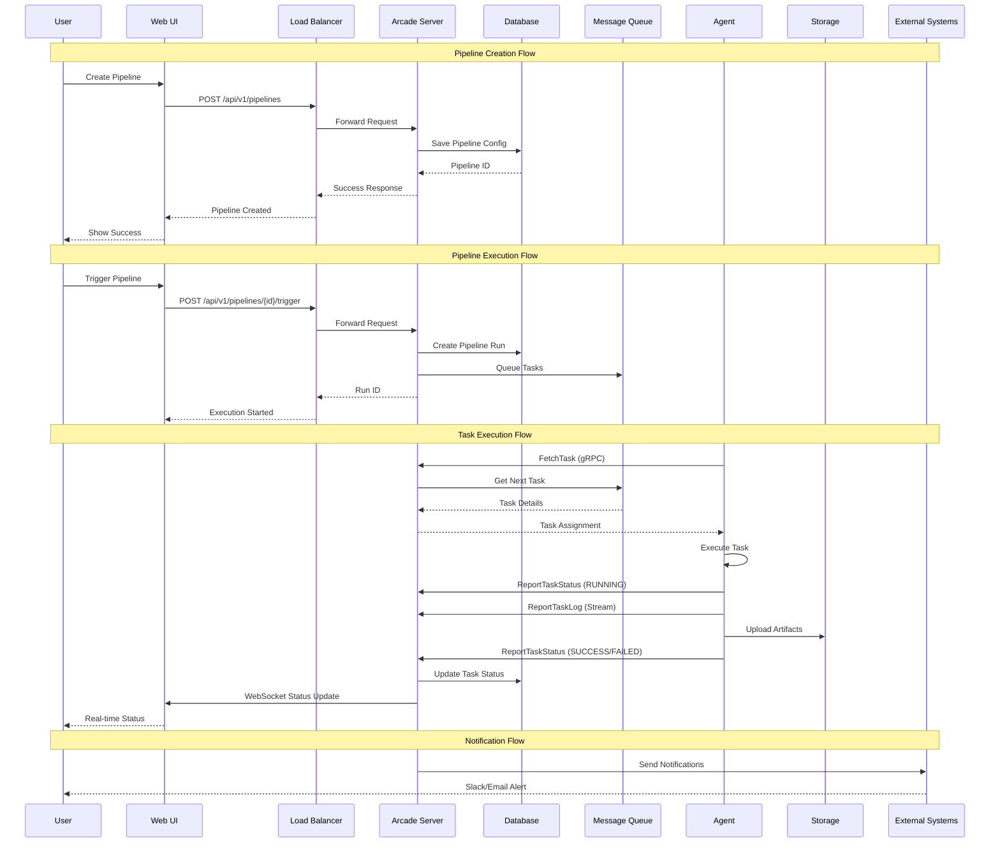
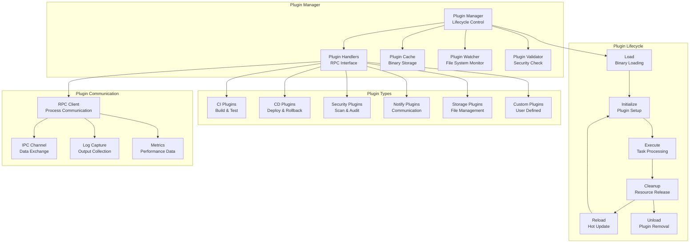
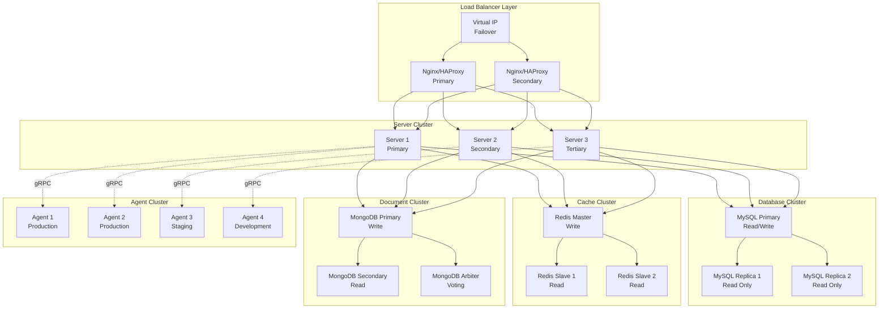

# 系统架构

Arcade 采用分布式 Server-Agent 架构，支持大规模任务执行和插件化扩展。

## 整体架构

### 系统架构图

```mermaid
graph TB
    subgraph "Client Layer"
        UI[Web UI<br/>React/Vue]
        CLI[CLI Client<br/>Go Binary]
        API[REST API Client<br/>SDK]
        IDE[IDE Plugins<br/>VSCode/IntelliJ]
    end
    
    subgraph "Load Balancer"
        LB[Nginx/HAProxy<br/>SSL Termination]
    end
    
    subgraph "Arcade Server Cluster"
        subgraph "Server Instance 1"
            subgraph "API Gateway"
                HTTP1[HTTP Server<br/>Fiber v2 :8080]
                GRPC1[gRPC Server<br/>Port :9090]
                WS1[WebSocket<br/>Real-time Updates]
            end
            
            subgraph "Core Services"
                PS1[Pipeline Service<br/>Orchestration]
                AS1[Agent Service<br/>Management]
                TS1[Task Service<br/>Scheduling]
                SS1[Storage Service<br/>Artifacts]
                AUTH1[Auth Service<br/>JWT/OAuth2]
                NOTIFY1[Notify Service<br/>Slack/Email]
            end
            
            subgraph "Plugin System"
                PM1[Plugin Manager<br/>Lifecycle]
                PH1[Plugin Handlers<br/>RPC Interface]
                PC1[Plugin Cache<br/>Binary Storage]
                PW1[Plugin Watcher<br/>Auto Reload]
            end
        end
        
        subgraph "Server Instance 2"
            HTTP2[HTTP Server]
            GRPC2[gRPC Server]
            PS2[Pipeline Service]
            AS2[Agent Service]
            TS2[Task Service]
        end
        
        subgraph "Server Instance 3"
            HTTP3[HTTP Server]
            GRPC3[gRPC Server]
            PS3[Pipeline Service]
            AS3[Agent Service]
            TS3[Task Service]
        end
    end
    
    subgraph "Data Layer"
        subgraph "Primary Database"
            MYSQL1[(MySQL Primary<br/>Metadata & Config)]
            MYSQL2[(MySQL Replica<br/>Read Operations)]
        end
        
        subgraph "Document Database"
            MONGO1[(MongoDB Primary<br/>Logs & Events)]
            MONGO2[(MongoDB Replica<br/>Analytics)]
        end
        
        subgraph "Cache Layer"
            REDIS1[(Redis Master<br/>Sessions & Cache)]
            REDIS2[(Redis Slave<br/>Read Cache)]
        end
        
        subgraph "Message Queue"
            MQ1[RabbitMQ/Kafka<br/>Task Queue]
            MQ2[RabbitMQ/Kafka<br/>Event Bus]
        end
    end
    
    subgraph "Storage Layer"
        subgraph "Object Storage"
            S3[AWS S3<br/>Artifacts]
            MINIO[MinIO<br/>Self-hosted]
            GCS[Google Cloud Storage<br/>Multi-region]
            OSS[Alibaba OSS<br/>China Region]
        end
        
        subgraph "File System"
            NFS[NFS/SMB<br/>Shared Storage]
            LOCAL[Local Storage<br/>Temporary Files]
        end
    end
    
    subgraph "Agent Cluster"
        subgraph "Production Agents"
            A1[Agent 1<br/>env=prod<br/>region=us-west]
            A2[Agent 2<br/>env=prod<br/>region=us-east]
            A3[Agent 3<br/>env=prod<br/>region=eu-west]
        end
        
        subgraph "Staging Agents"
            A4[Agent 4<br/>env=staging<br/>region=us-west]
            A5[Agent 5<br/>env=staging<br/>region=us-east]
        end
        
        subgraph "Development Agents"
            A6[Agent 6<br/>env=dev<br/>region=local]
            A7[Agent 7<br/>env=dev<br/>region=local]
        end
        
        subgraph "Specialized Agents"
            A8[GPU Agent<br/>gpu=true<br/>ml-tasks]
            A9[Windows Agent<br/>os=windows<br/>dotnet-builds]
        end
    end
    
    subgraph "External Systems"
        subgraph "Version Control"
            GIT1[GitHub<br/>Source Code]
            GIT2[GitLab<br/>Enterprise]
            GIT3[Bitbucket<br/>Atlassian]
        end
        
        subgraph "Container Registry"
            REG1[Docker Hub<br/>Public Images]
            REG2[AWS ECR<br/>Private Images]
            REG3[Azure ACR<br/>Enterprise]
        end
        
        subgraph "Notification Services"
            SLACK[Slack<br/>Team Communication]
            EMAIL[SMTP<br/>Email Notifications]
            WEBHOOK[Webhooks<br/>Custom Integrations]
        end
        
        subgraph "Monitoring & Observability"
            PROMETHEUS[Prometheus<br/>Metrics Collection]
            GRAFANA[Grafana<br/>Dashboards]
            ELK[ELK Stack<br/>Log Aggregation]
            JAEGER[Jaeger<br/>Distributed Tracing]
        end
    end
    
    %% Client connections
    UI --> LB
    CLI --> LB
    API --> LB
    IDE --> LB
    
    %% Load balancer to servers
    LB --> HTTP1
    LB --> HTTP2
    LB --> HTTP3
    
    %% Server internal connections
    HTTP1 --> PS1
    HTTP1 --> AS1
    HTTP1 --> TS1
    GRPC1 --> AS1
    GRPC1 --> TS1
    WS1 --> PS1
    
    %% Service connections
    PS1 --> PM1
    AS1 --> PM1
    TS1 --> PM1
    PS1 --> NOTIFY1
    
    %% Data connections
    PS1 --> MYSQL1
    AS1 --> MYSQL1
    TS1 --> MYSQL1
    PS1 --> MONGO1
    AS1 --> REDIS1
    TS1 --> REDIS1
    PS1 --> MQ1
    
    %% Database replication
    MYSQL1 --> MYSQL2
    MONGO1 --> MONGO2
    REDIS1 --> REDIS2
    
    %% Storage connections
    TS1 --> S3
    TS1 --> MINIO
    TS1 --> GCS
    TS1 --> OSS
    
    %% Agent connections
    AS1 -.->|gRPC| A1
    AS1 -.->|gRPC| A2
    AS2 -.->|gRPC| A3
    AS2 -.->|gRPC| A4
    AS3 -.->|gRPC| A5
    AS3 -.->|gRPC| A6
    
    %% External connections
    PS1 --> GIT1
    TS1 --> REG1
    NOTIFY1 --> SLACK
    NOTIFY1 --> EMAIL
    
    %% Monitoring connections
    PS1 --> PROMETHEUS
    AS1 --> PROMETHEUS
    TS1 --> PROMETHEUS
    PS1 --> ELK
    AS1 --> ELK
    TS1 --> ELK
```



### 数据流架构图



## 核心组件详解

### Server 组件

#### API Gateway Layer
- **HTTP Server**: 基于 Fiber v2 的高性能 HTTP 服务器
  - 端口: 8080
  - 支持: RESTful API, WebSocket, 静态文件服务
  - 特性: CORS, 中间件, 请求限流
  
- **gRPC Server**: 高性能的 Agent 通信接口
  - 端口: 9090
  - 协议: Protocol Buffers
  - 特性: 双向流, 负载均衡, 连接池
  
- **WebSocket**: 实时状态更新和日志流
  - 支持: 任务状态, 流水线状态, 实时日志
  - 特性: 自动重连, 消息确认, 订阅管理

#### Core Services Layer
- **Pipeline Service**: 流水线管理和执行
  - 功能: 流水线创建、触发、停止、监控
  - 特性: 阶段依赖、并行执行、条件分支
  
- **Agent Service**: Agent 生命周期管理
  - 功能: Agent 注册、心跳、标签管理、健康检查
  - 特性: 自动故障转移、负载均衡、资源监控
  
- **Task Service**: 任务调度和执行
  - 功能: 任务分发、状态跟踪、日志收集
  - 特性: 优先级队列、重试机制、超时控制
  
- **Storage Service**: 存储后端管理
  - 功能: 多存储后端、文件上传下载、权限控制
  - 特性: 分片上传、断点续传、CDN 集成
  
- **Auth Service**: 认证和授权
  - 功能: JWT 认证、OAuth2 集成、RBAC 权限
  - 特性: 单点登录、多因子认证、审计日志

#### Plugin System Layer
- **Plugin Manager**: 插件生命周期管理
  - 功能: 插件加载、初始化、健康检查、卸载
  - 特性: 热加载、自动发现、版本管理
  
- **Plugin Handlers**: 插件接口实现
  - 功能: RPC 通信、接口适配、错误处理
  - 特性: 进程隔离、资源限制、日志捕获
  
- **Plugin Cache**: 插件文件缓存
  - 功能: 插件存储、版本管理、分发优化
  - 特性: 增量更新、校验和验证、压缩存储

### Agent 组件

#### Agent Process
- **gRPC Client**: 与 Server 通信
  - 功能: 注册、心跳、任务拉取、状态上报
  - 特性: 自动重连、连接池、错误重试
  
- **Task Executor**: 任务执行引擎
  - 功能: 命令执行、环境管理、资源监控
  - 特性: 容器支持、资源限制、超时控制
  
- **Plugin Manager**: 本地插件管理
  - 功能: 插件下载、本地缓存、执行管理
  - 特性: 自动更新、依赖管理、权限控制
  
- **Status Reporter**: 状态和日志上报
  - 功能: 实时状态、日志流、指标收集
  - 特性: 批量上报、压缩传输、错误恢复

#### Local Plugins
- **CI Plugins**: 构建、测试插件
  - 类型: Maven, Gradle, npm, Docker, Kubernetes
  - 特性: 多语言支持、依赖管理、缓存优化
  
- **CD Plugins**: 部署、回滚插件
  - 类型: Kubernetes, Docker Swarm, AWS ECS
  - 特性: 蓝绿部署、金丝雀发布、自动回滚
  
- **Security Plugins**: 安全扫描插件
  - 类型: SAST, DAST, 依赖扫描, 镜像扫描
  - 特性: 漏洞检测、合规检查、报告生成

## 数据模型详解

### 核心实体关系

```mermaid
erDiagram
    Organization ||--o{ Project : contains
    Project ||--o{ Pipeline : defines
    Pipeline ||--o{ PipelineRun : executes
    PipelineRun ||--o{ Task : contains
    Task ||--o{ TaskLog : generates
    Task ||--o{ Artifact : produces
    Task ||--o{ TaskMetric : collects
    
    Agent ||--o{ Task : executes
    Agent ||--o{ AgentMetric : reports
    Agent ||--o{ AgentPlugin : installs
    
    Plugin ||--o{ AgentPlugin : installed_on
    Plugin ||--o{ PluginVersion : has_versions
    
    User ||--o{ Project : owns
    User ||--o{ Pipeline : creates
    User ||--o{ Task : triggers
    
    Team ||--o{ User : contains
    Team ||--o{ Project : accesses
    
    Organization {
        string org_id PK
        string name
        string description
        string domain
        enum status
        timestamp created_at
        timestamp updated_at
    }
    
    Project {
        string project_id PK
        string org_id FK
        string name
        string description
        string repo_url
        string default_branch
        map settings
        enum visibility
        timestamp created_at
        timestamp updated_at
    }
    
    Pipeline {
        string pipeline_id PK
        string project_id FK
        string name
        string description
        string repo_url
        string branch
        repeated Stage stages
        map env
        enum trigger_type
        string cron
        string created_by FK
        enum status
        timestamp created_at
        timestamp updated_at
    }
    
    PipelineRun {
        string run_id PK
        string pipeline_id FK
        string branch
        string commit_sha
        string commit_message
        string triggered_by FK
        enum status
        int32 total_tasks
        int32 completed_tasks
        int32 failed_tasks
        timestamp start_time
        timestamp end_time
        timestamp created_at
    }
    
    Task {
        string task_id PK
        string run_id FK
        string pipeline_id FK
        string agent_id FK
        string name
        int32 stage
        repeated string commands
        map env
        string workspace
        int32 timeout
        string image
        map secrets
        repeated Artifact artifacts
        LabelSelector label_selector
        repeated PluginInfo plugins
        enum status
        int32 exit_code
        string error_message
        timestamp start_time
        timestamp end_time
        timestamp created_at
    }
    
    Agent {
        string agent_id PK
        string hostname
        string ip
        string os
        string arch
        string version
        int32 max_concurrent_jobs
        int32 running_jobs_count
        map labels
        map capabilities
        enum status
        timestamp last_heartbeat
        timestamp created_at
        timestamp updated_at
    }
    
    Plugin {
        string plugin_id PK
        string name
        string type
        string description
        string author
        string repository
        enum status
        timestamp created_at
        timestamp updated_at
    }
    
    PluginVersion {
        string version_id PK
        string plugin_id FK
        string version
        string checksum
        int64 size
        string download_url
        enum location
        map metadata
        timestamp created_at
    }
    
    User {
        string user_id PK
        string username
        string email
        string full_name
        string avatar_url
        enum role
        enum status
        timestamp last_login
        timestamp created_at
        timestamp updated_at
    }
    
    Team {
        string team_id PK
        string org_id FK
        string name
        string description
        enum role
        timestamp created_at
        timestamp updated_at
    }
```

## 通信协议详解

### gRPC 服务接口

#### Agent Service
```protobuf
service AgentService {
    // Agent 生命周期管理
    rpc Register(RegisterRequest) returns (RegisterResponse);
    rpc Unregister(UnregisterRequest) returns (UnregisterResponse);
    rpc Heartbeat(HeartbeatRequest) returns (HeartbeatResponse);
    rpc UpdateLabels(UpdateLabelsRequest) returns (UpdateLabelsResponse);
    
    // 任务管理
    rpc FetchTask(FetchTaskRequest) returns (FetchTaskResponse);
    rpc ReportTaskStatus(ReportTaskStatusRequest) returns (ReportTaskStatusResponse);
    rpc ReportTaskLog(ReportTaskLogRequest) returns (ReportTaskLogResponse);
    rpc CancelTask(CancelTaskRequest) returns (CancelTaskResponse);
    
    // 插件管理
    rpc DownloadPlugin(DownloadPluginRequest) returns (DownloadPluginResponse);
    rpc ListAvailablePlugins(ListAvailablePluginsRequest) returns (ListAvailablePluginsResponse);
    
    // 双向流通信
    rpc AgentChannel(stream AgentMessage) returns (stream ServerMessage);
}
```

#### Pipeline Service
```protobuf
service PipelineService {
    // 流水线管理
    rpc CreatePipeline(CreatePipelineRequest) returns (CreatePipelineResponse);
    rpc GetPipeline(GetPipelineRequest) returns (GetPipelineResponse);
    rpc ListPipelines(ListPipelinesRequest) returns (ListPipelinesResponse);
    rpc UpdatePipeline(UpdatePipelineRequest) returns (UpdatePipelineResponse);
    rpc DeletePipeline(DeletePipelineRequest) returns (DeletePipelineResponse);
    
    // 流水线执行
    rpc TriggerPipeline(TriggerPipelineRequest) returns (TriggerPipelineResponse);
    rpc StopPipeline(StopPipelineRequest) returns (StopPipelineResponse);
    rpc RetryPipeline(RetryPipelineRequest) returns (RetryPipelineResponse);
    
    // 状态监控
    rpc GetPipelineStatus(GetPipelineStatusRequest) returns (GetPipelineStatusResponse);
    rpc StreamPipelineStatus(StreamPipelineStatusRequest) returns (stream PipelineStatusUpdate);
}
```

#### Task Service
```protobuf
service TaskService {
    // 任务管理
    rpc CreateTask(CreateTaskRequest) returns (CreateTaskResponse);
    rpc GetTask(GetTaskRequest) returns (GetTaskResponse);
    rpc ListTasks(ListTasksRequest) returns (ListTasksResponse);
    rpc UpdateTask(UpdateTaskRequest) returns (UpdateTaskResponse);
    rpc CancelTask(CancelTaskRequest) returns (CancelTaskResponse);
    
    // 日志管理
    rpc GetTaskLog(GetTaskLogRequest) returns (GetTaskLogResponse);
    rpc StreamTaskLog(StreamTaskLogRequest) returns (stream LogEntry);
    
    // 产物管理
    rpc ListTaskArtifacts(ListTaskArtifactsRequest) returns (ListTaskArtifactsResponse);
    rpc DownloadArtifact(DownloadArtifactRequest) returns (stream ArtifactChunk);
}
```

### REST API 接口

#### 基础路径
- **API 版本**: `/api/v1`
- **认证方式**: JWT Token, API Key
- **数据格式**: JSON
- **内容类型**: `application/json`

#### 核心端点
```http
# 系统信息
GET    /health                    # 健康检查
GET    /version                   # 版本信息
GET    /metrics                   # Prometheus 指标

# 认证授权
POST   /auth/login               # 用户登录
POST   /auth/refresh             # 刷新 Token
POST   /auth/logout              # 用户登出
GET    /auth/profile             # 用户信息

# 组织管理
GET    /organizations            # 组织列表
POST   /organizations            # 创建组织
GET    /organizations/{id}       # 组织详情
PUT    /organizations/{id}       # 更新组织
DELETE /organizations/{id}       # 删除组织

# 项目管理
GET    /projects                 # 项目列表
POST   /projects                # 创建项目
GET    /projects/{id}           # 项目详情
PUT    /projects/{id}           # 更新项目
DELETE /projects/{id}           # 删除项目

# 流水线管理
GET    /pipelines               # 流水线列表
POST   /pipelines               # 创建流水线
GET    /pipelines/{id}          # 流水线详情
PUT    /pipelines/{id}          # 更新流水线
DELETE /pipelines/{id}          # 删除流水线
POST   /pipelines/{id}/trigger  # 触发流水线
POST   /pipelines/{id}/stop     # 停止流水线

# 任务管理
GET    /tasks                   # 任务列表
GET    /tasks/{id}              # 任务详情
POST   /tasks/{id}/cancel       # 取消任务
GET    /tasks/{id}/logs         # 任务日志
GET    /tasks/{id}/artifacts    # 任务产物

# Agent 管理
GET    /agents                  # Agent 列表
GET    /agents/{id}             # Agent 详情
PUT    /agents/{id}/labels      # 更新 Agent 标签
POST   /agents/{id}/restart     # 重启 Agent

# 插件管理
GET    /plugins                 # 插件列表
POST   /plugins/upload          # 上传插件
GET    /plugins/{id}            # 插件详情
PUT    /plugins/{id}            # 更新插件
DELETE /plugins/{id}             # 删除插件

# 存储管理
GET    /storage/configs         # 存储配置列表
POST   /storage/configs         # 创建存储配置
GET    /storage/configs/{id}    # 存储配置详情
PUT    /storage/configs/{id}    # 更新存储配置
DELETE /storage/configs/{id}    # 删除存储配置

# 用户管理
GET    /users                   # 用户列表
POST   /users                   # 创建用户
GET    /users/{id}              # 用户详情
PUT    /users/{id}              # 更新用户
DELETE /users/{id}              # 删除用户

# 团队管理
GET    /teams                   # 团队列表
POST   /teams                   # 创建团队
GET    /teams/{id}              # 团队详情
PUT    /teams/{id}              # 更新团队
DELETE /teams/{id}              # 删除团队
```

## 标签选择器系统

### 标签匹配机制

Arcade 使用强大的标签选择器实现任务到 Agent 的智能路由：

#### 精确匹配 (match_labels)
```protobuf
label_selector {
  match_labels {
    "env": "production",
    "region": "us-west",
    "os": "linux"
  }
}
```

#### 表达式匹配 (match_expressions)
支持 6 种操作符：

1. **IN**: 标签值在列表中
```protobuf
match_expressions {
  key: "env"
  operator: LABEL_OPERATOR_IN
  values: ["production", "staging"]
}
```

2. **NOT_IN**: 标签值不在列表中
```protobuf
match_expressions {
  key: "env"
  operator: LABEL_OPERATOR_NOT_IN
  values: ["development", "test"]
}
```

3. **EXISTS**: 标签 key 存在
```protobuf
match_expressions {
  key: "gpu"
  operator: LABEL_OPERATOR_EXISTS
}
```

4. **NOT_EXISTS**: 标签 key 不存在
```protobuf
match_expressions {
  key: "maintenance"
  operator: LABEL_OPERATOR_NOT_EXISTS
}
```

5. **GT**: 标签值大于指定值 (数值比较)
```protobuf
match_expressions {
  key: "cpu-cores"
  operator: LABEL_OPERATOR_GT
  values: ["8"]
}
```

6. **LT**: 标签值小于指定值 (数值比较)
```protobuf
match_expressions {
  key: "memory-gb"
  operator: LABEL_OPERATOR_LT
  values: ["32"]
}
```

#### 复杂匹配示例
```protobuf
label_selector {
  match_labels {
    "env": "production"
  }
  match_expressions {
    key: "region"
    operator: LABEL_OPERATOR_IN
    values: ["us-west", "us-east"]
  }
  match_expressions {
    key: "gpu"
    operator: LABEL_OPERATOR_EXISTS
  }
  match_expressions {
    key: "cpu-cores"
    operator: LABEL_OPERATOR_GT
    values: ["16"]
  }
}
```

#### 使用场景
- **环境隔离**: `env=production`, `env=staging`, `env=dev`
- **地域分布**: `region=us-west`, `region=cn-north`, `region=eu-west`
- **硬件能力**: `gpu=true`, `cpu=high-performance`, `memory=large`
- **专用任务**: `build=android`, `deploy=kubernetes`, `test=integration`
- **版本控制**: `agent-version=v1.2.0`, `plugin-version=latest`
- **团队隔离**: `team=backend`, `team=frontend`, `team=devops`

## 插件系统详解

### 插件架构



### 插件特性

#### 热加载机制
- **文件监控**: 监控插件目录变化
- **自动发现**: 新插件自动加载
- **版本管理**: 插件版本控制和更新
- **依赖检查**: 插件依赖关系验证

#### 进程隔离
- **独立进程**: 每个插件运行在独立进程
- **资源限制**: CPU、内存使用限制
- **权限控制**: 文件系统访问权限
- **网络隔离**: 网络访问控制

#### RPC 通信
- **协议**: 基于 net/rpc 的进程间通信
- **序列化**: JSON 格式数据交换
- **错误处理**: 完善的错误处理机制
- **超时控制**: 请求超时和重试

#### 日志捕获
- **标准输出**: 捕获插件 stdout
- **错误输出**: 捕获插件 stderr
- **日志级别**: 支持不同日志级别
- **实时传输**: 实时日志流传输

#### 健康检查
- **心跳检测**: 定期插件状态检查
- **自动重启**: 异常插件自动重启
- **故障转移**: 插件故障时的任务转移
- **性能监控**: 插件性能指标收集

### 插件开发

#### 插件接口
```go
type Plugin interface {
    // 插件信息
    GetInfo() PluginInfo
    
    // 插件初始化
    Init(config map[string]interface{}) error
    
    // 执行任务
    Execute(ctx context.Context, task Task) (*TaskResult, error)
    
    // 清理资源
    Cleanup() error
    
    // 健康检查
    Ping() error
    
    // 获取指标
    GetMetrics() PluginMetrics
}
```

#### 插件配置
```json
{
  "name": "docker-build",
  "type": "ci",
  "version": "1.0.0",
  "description": "Docker build plugin",
  "author": "Arcade Team",
  "repository": "https://github.com/go-arcade/plugins",
  "dependencies": {
    "docker": ">=20.0.0"
  },
  "config": {
    "registry": "docker.io",
    "namespace": "mycompany",
    "cache": true,
    "multi_stage": true
  },
  "capabilities": {
    "parallel": true,
    "caching": true,
    "artifacts": true
  }
}
```

## 部署架构详解

### 容器化部署

#### Docker 化
```dockerfile
# 多阶段构建
FROM golang:1.24-alpine AS builder

# 设置工作目录
WORKDIR /app

# 复制源码
COPY . .

# 安装依赖
RUN go mod download

# 构建应用
RUN CGO_ENABLED=0 GOOS=linux go build -a -installsuffix cgo -o arcade cmd/arcade/main.go

# 运行阶段
FROM alpine:latest

# 安装必要的包
RUN apk --no-cache add ca-certificates tzdata

# 设置时区
RUN cp /usr/share/zoneinfo/Asia/Shanghai /etc/localtime

# 创建非 root 用户
RUN adduser -D -s /bin/sh arcade

# 设置工作目录
WORKDIR /app

# 复制二进制文件
COPY --from=builder /app/arcade .

# 复制配置文件
COPY conf.d/ conf.d/

# 设置权限
RUN chown -R arcade:arcade /app

# 切换到非 root 用户
USER arcade

# 暴露端口
EXPOSE 8080 9090

# 健康检查
HEALTHCHECK --interval=30s --timeout=3s --start-period=5s --retries=3 \
  CMD wget --no-verbose --tries=1 --spider http://localhost:8080/health || exit 1

# 启动命令
CMD ["./arcade", "--conf", "conf.d/config.toml"]
```

#### Docker Compose
```yaml
version: '3.8'

services:
  arcade-server:
    build: .
    ports:
      - "8080:8080"
      - "9090:9090"
    environment:
      - DATABASE_HOST=mysql
      - REDIS_HOST=redis
      - MONGODB_HOST=mongodb
    depends_on:
      - mysql
      - redis
      - mongodb
    volumes:
      - ./conf.d:/app/conf.d
      - ./plugins:/app/plugins
      - ./logs:/app/logs
    networks:
      - arcade-network

  mysql:
    image: mysql:8.0
    environment:
      MYSQL_ROOT_PASSWORD: password
      MYSQL_DATABASE: arcade
    volumes:
      - mysql_data:/var/lib/mysql
    networks:
      - arcade-network

  redis:
    image: redis:7-alpine
    volumes:
      - redis_data:/data
    networks:
      - arcade-network

  mongodb:
    image: mongo:6
    environment:
      MONGO_INITDB_ROOT_USERNAME: admin
      MONGO_INITDB_ROOT_PASSWORD: password
    volumes:
      - mongodb_data:/data/db
    networks:
      - arcade-network

volumes:
  mysql_data:
  redis_data:
  mongodb_data:

networks:
  arcade-network:
    driver: bridge
```

### Kubernetes 部署

#### Deployment
```yaml
apiVersion: apps/v1
kind: Deployment
metadata:
  name: arcade-server
  labels:
    app: arcade-server
spec:
  replicas: 3
  selector:
    matchLabels:
      app: arcade-server
  template:
    metadata:
      labels:
        app: arcade-server
    spec:
      containers:
      - name: arcade-server
        image: arcade:latest
        ports:
        - containerPort: 8080
          name: http
        - containerPort: 9090
          name: grpc
        env:
        - name: DATABASE_HOST
          value: "mysql-service"
        - name: REDIS_HOST
          value: "redis-service"
        - name: MONGODB_HOST
          value: "mongodb-service"
        resources:
          requests:
            memory: "512Mi"
            cpu: "500m"
          limits:
            memory: "1Gi"
            cpu: "1000m"
        livenessProbe:
          httpGet:
            path: /health
            port: 8080
          initialDelaySeconds: 30
          periodSeconds: 10
        readinessProbe:
          httpGet:
            path: /health
            port: 8080
          initialDelaySeconds: 5
          periodSeconds: 5
        volumeMounts:
        - name: config
          mountPath: /app/conf.d
        - name: plugins
          mountPath: /app/plugins
        - name: logs
          mountPath: /app/logs
      volumes:
      - name: config
        configMap:
          name: arcade-config
      - name: plugins
        persistentVolumeClaim:
          claimName: arcade-plugins-pvc
      - name: logs
        persistentVolumeClaim:
          claimName: arcade-logs-pvc
```

#### Service
```yaml
apiVersion: v1
kind: Service
metadata:
  name: arcade-service
spec:
  selector:
    app: arcade-server
  ports:
  - name: http
    port: 8080
    targetPort: 8080
  - name: grpc
    port: 9090
    targetPort: 9090
  type: ClusterIP
```

#### Ingress
```yaml
apiVersion: networking.k8s.io/v1
kind: Ingress
metadata:
  name: arcade-ingress
  annotations:
    nginx.ingress.kubernetes.io/rewrite-target: /
    nginx.ingress.kubernetes.io/ssl-redirect: "true"
spec:
  tls:
  - hosts:
    - arcade.example.com
    secretName: arcade-tls
  rules:
  - host: arcade.example.com
    http:
      paths:
      - path: /
        pathType: Prefix
        backend:
          service:
            name: arcade-service
            port:
              number: 8080
```

### 高可用架构



## 性能特性

### 高并发支持

#### 连接池管理
- **数据库连接池**: MySQL 最大 500 连接，Redis 最大 50 连接
- **gRPC 连接池**: Agent 连接复用，最大 1000 连接
- **HTTP 连接池**: 客户端连接复用，Keep-Alive 支持

#### 异步处理
- **任务队列**: 基于 Redis 的任务队列
- **消息队列**: RabbitMQ/Kafka 异步消息处理
- **协程池**: Go 协程池管理，避免协程泄漏

#### 负载均衡
- **Agent 负载均衡**: 基于标签和负载的任务分发
- **Server 负载均衡**: 多实例负载均衡
- **数据库负载均衡**: 读写分离，读操作分发到从库

#### 缓存优化
- **多级缓存**: L1(内存) + L2(Redis) + L3(数据库)
- **缓存预热**: 系统启动时预加载热点数据
- **缓存更新**: 基于事件的缓存失效策略
- **缓存穿透**: 布隆过滤器防止缓存穿透

### 可扩展性

#### 水平扩展
- **无状态设计**: Server 无状态，支持水平扩展
- **数据分片**: 按项目或时间分片
- **服务拆分**: 微服务架构，独立扩展

#### 垂直扩展
- **资源扩展**: CPU、内存、磁盘扩展
- **Agent 扩展**: 支持更多并发任务
- **存储扩展**: 支持更大存储容量

#### 插件扩展
- **功能插件化**: 核心功能插件化
- **热加载**: 插件动态加载
- **版本管理**: 插件版本控制

#### 存储扩展
- **多存储后端**: S3、MinIO、GCS、OSS
- **CDN 集成**: 静态资源 CDN 加速
- **分片存储**: 大文件分片存储

## 监控和运维

### 监控指标

#### 业务指标
- **任务执行成功率**: 成功率 > 99%
- **平均执行时间**: 任务平均执行时间
- **并发任务数**: 当前并发执行任务数
- **队列长度**: 待执行任务队列长度

#### 系统指标
- **CPU 使用率**: 服务器 CPU 使用率
- **内存使用率**: 服务器内存使用率
- **磁盘使用率**: 磁盘空间使用率
- **网络流量**: 网络入站和出站流量

#### 应用指标
- **HTTP 请求数**: 每秒 HTTP 请求数
- **gRPC 调用数**: 每秒 gRPC 调用数
- **数据库连接数**: 当前数据库连接数
- **缓存命中率**: Redis 缓存命中率

### 日志管理

#### 结构化日志
```json
{
  "timestamp": "2024-01-01T12:00:00.000Z",
  "level": "INFO",
  "service": "arcade-server",
  "component": "pipeline-service",
  "trace_id": "abc123",
  "span_id": "def456",
  "message": "Pipeline triggered successfully",
  "fields": {
    "pipeline_id": "pipeline_123",
    "user_id": "user_456",
    "duration_ms": 150
  }
}
```

#### 日志聚合
- **ELK Stack**: Elasticsearch + Logstash + Kibana
- **日志收集**: Filebeat 收集应用日志
- **日志解析**: Logstash 解析结构化日志
- **日志搜索**: Kibana 提供日志搜索界面

#### 实时日志
- **WebSocket 流**: 实时日志流传输
- **日志过滤**: 按级别、组件、用户过滤
- **日志下载**: 支持日志文件下载
- **日志轮转**: 自动日志轮转和清理

### 健康检查

#### 服务健康
```http
GET /health
```

**响应**:
```json
{
  "status": "healthy",
  "timestamp": "2024-01-01T12:00:00.000Z",
  "services": {
    "database": "healthy",
    "redis": "healthy",
    "mongodb": "healthy",
    "plugins": "healthy"
  },
  "metrics": {
    "uptime": "72h30m15s",
    "memory_usage": "512MB",
    "cpu_usage": "45%"
  }
}
```

#### 数据库健康
- **连接检查**: 数据库连接状态检查
- **查询测试**: 简单查询测试
- **复制延迟**: 主从复制延迟检查
- **磁盘空间**: 数据库磁盘空间检查

#### Agent 健康
- **心跳检查**: Agent 心跳状态检查
- **任务状态**: Agent 任务执行状态
- **资源使用**: Agent 资源使用情况
- **插件状态**: Agent 插件状态检查

#### 插件健康
- **进程状态**: 插件进程状态检查
- **RPC 通信**: 插件 RPC 通信测试
- **资源使用**: 插件资源使用情况
- **错误统计**: 插件错误统计信息