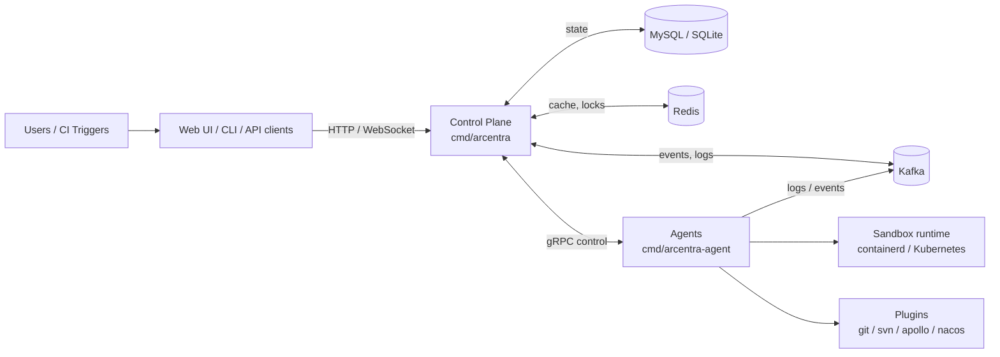

Arcentra is split into two long-running services and a shared library layer:

- **Control plane** (`cmd/arcentra`) — owns pipelines, runs, identity,
  scheduling, and the public HTTP/gRPC/WebSocket surfaces.
- **Agent** (`cmd/arcentra-agent`) — connects to the control plane, pulls
  step runs, executes them in a sandbox or directly on the host, and reports
  status, logs, and artifacts back.
- **Shared runtime** (`internal/shared/...`) — pipeline orchestration, DSL,
  builtins, executors, notifications, storage, and gRPC clients/interceptors
  used by both services.

## Component overview

## Control plane

The control plane is bootstrapped from
[`internal/control/bootstrap`](https://github.com/arcentrix/arcentra/tree/main/internal/control/bootstrap)
and reads two configuration files (`-conf` and `-plugin-conf`). It exposes:

- **HTTP API** for pipelines, runs, identities, settings, uploads, and the
  WebSocket gateway. Defaults to `:8080`.
- **gRPC services** for agent control, gateway ingestion, pipeline, step run,
  and streaming. Defaults to `:9090`.
- **Metrics** on `:8082` and optional OTLP tracing.

State is persisted in a SQL database (MySQL preferred for production), Redis
is used for caching and short-lived coordination, and Kafka carries logs and
events between the data plane and the control plane.

## Agent

The agent is bootstrapped from
[`internal/agent/bootstrap`](https://github.com/arcentrix/arcentra/tree/main/internal/agent/bootstrap)
and reads a single configuration file. It:

- Registers with the control plane and sends periodic heartbeats.
- Pulls step runs that match its label selector and concurrency budget.
- Executes builtins (such as `shell`) and plugins (such as `git`, `svn`,
  `apollo`, `nacos`) inside the configured sandbox.
- Reports step run status, logs, and artifacts back over gRPC and Kafka.

Agents are designed to run in mixed environments: bare metal, containerd,
Kubernetes pods, or any host that can reach the control plane over gRPC.

## Pipeline runtime

The pipeline runtime lives in
[`internal/shared/pipeline`](https://github.com/arcentrix/arcentra/tree/main/internal/shared/pipeline)
and is reused by both services. Key concepts:

- **Pipeline** — a versioned definition stored alongside a project,
  optionally backed by a Git repository and a `pipeline.yaml` file.
- **Stage / Job / Step** — the structural decomposition of a pipeline.
  Pipelines may use either `stages` mode (`Stage → Jobs → Steps`) or `jobs`
  mode (jobs are wrapped in a default stage).
- **PipelineRun / JobRun / StepRun** — the runtime counterparts that carry
  state, status, and outputs.
- **Triggers** — manual, cron/schedule, or event/webhook triggers, including
  approval gates.
- **Executors and builtins** — the local execution model (`shell`, `stdout`,
  artifacts, reports, SCM) plus plugin-driven actions through `uses + action +
  args`.

For the user-facing model and HTTP shape, see [Pipelines](/en/pipelines).

## Plugins and extensibility

Plugins are loaded from the binary import set (see
[`cmd/arcentra/main.go`](https://github.com/arcentrix/arcentra/blob/main/cmd/arcentra/main.go))
and configured via `conf.d/plugins.toml`. Out of the box Arcentra ships
plugins for:

- **Git** and **SVN** source checkout
- **Apollo** and **Nacos** configuration centers

The same interface model is used to extend Arcentra with new actions and
integrations without changing the control plane.

## Observability and governance

- **Metrics** are exposed in Prometheus format on the metrics port.
- **Tracing** uses OpenTelemetry and can target OTLP-gRPC, OTLP-HTTP, or
  Jaeger.
- **Logs** flow through structured loggers; multi-category logging is
  supported (HTTP, plugin, cron, and custom categories).
- **Events** follow a CloudEvents-compatible mapping for plugin and pipeline
  lifecycle changes.

These signals are designed for governance use cases such as audit trails,
SLO dashboards, and cross-team operational reviews.
