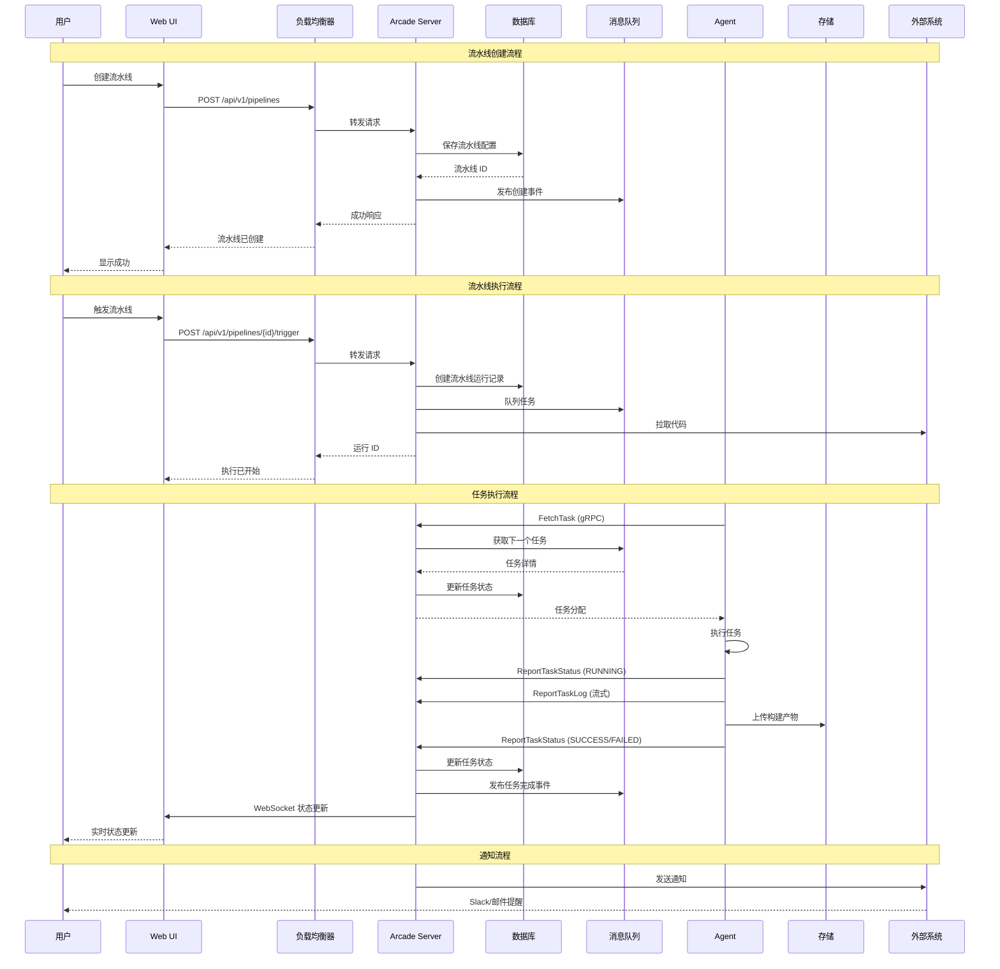
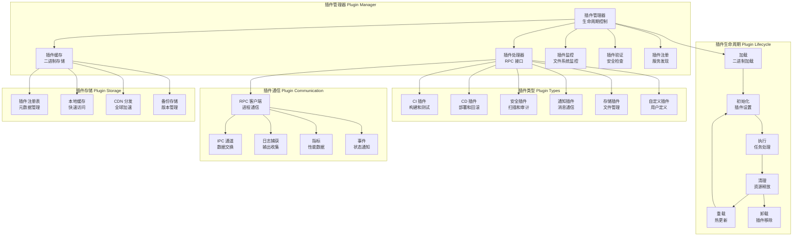
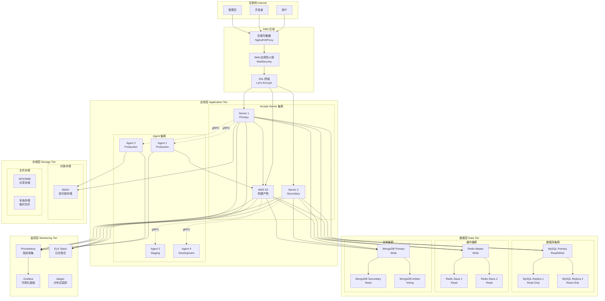
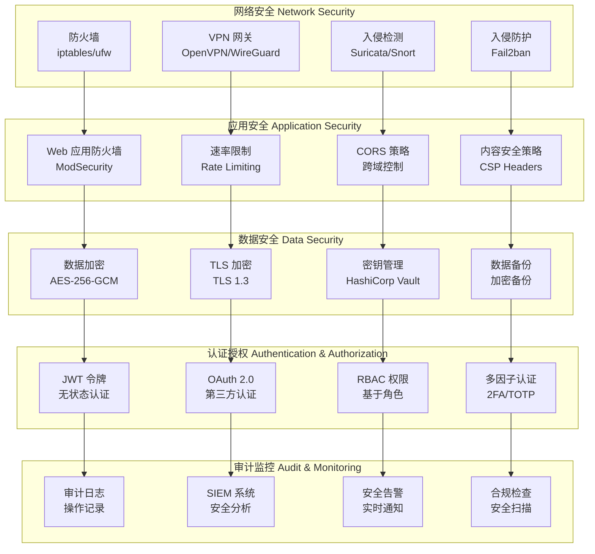
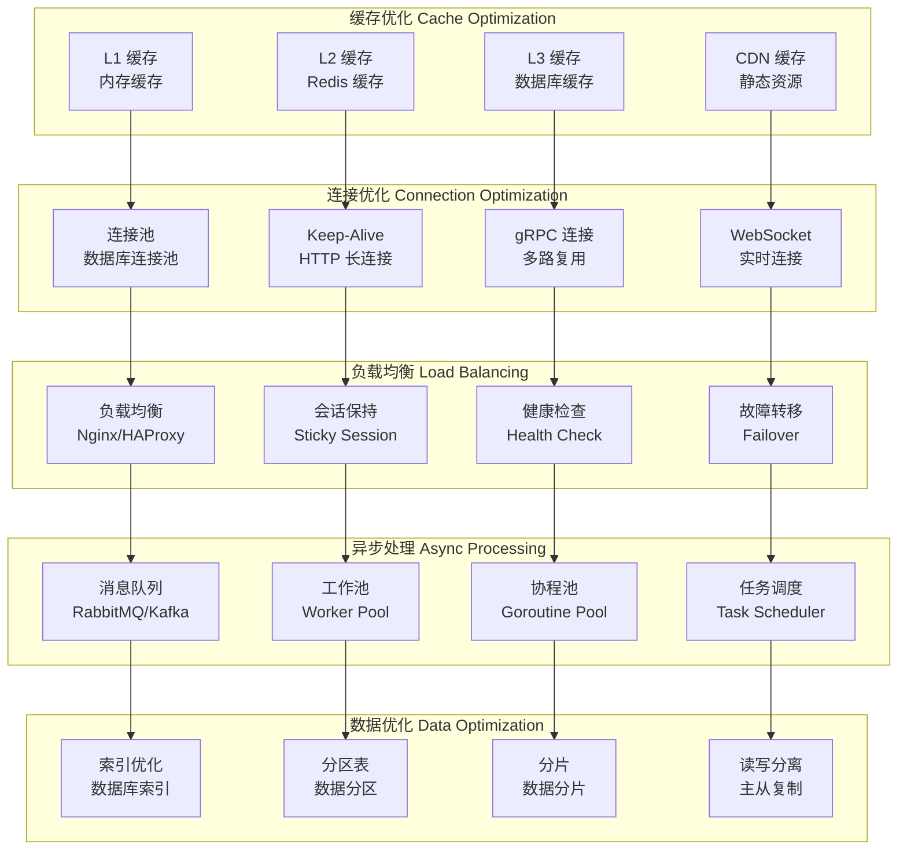
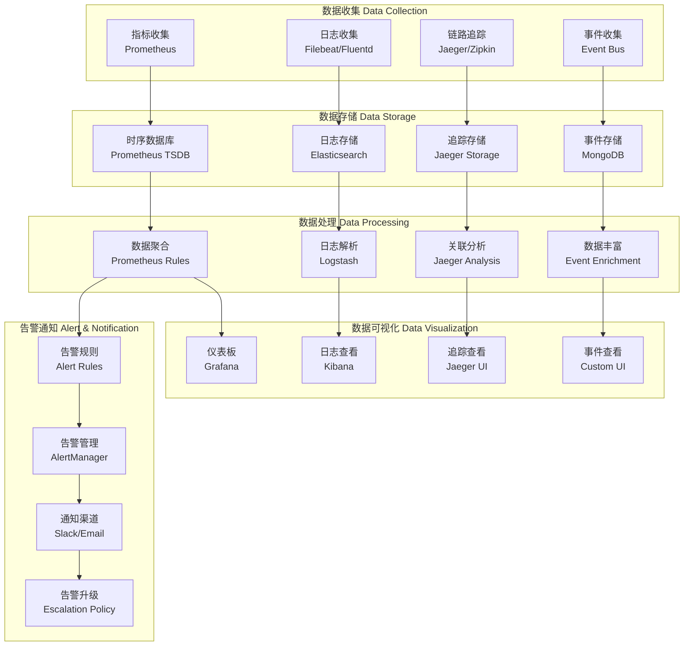

# 系统设计图

## 整体架构设计

### 系统架构全景图

```mermaid
graph TB
    subgraph "用户层 User Layer"
        WEB[Web 用户界面<br/>React/Vue.js]
        CLI[命令行工具<br/>Go CLI]
        API[API 客户端<br/>SDK/Postman]
        IDE[IDE 插件<br/>VSCode/IntelliJ]
    end
    
    subgraph "接入层 Access Layer"
        CDN[CDN 加速<br/>CloudFlare/AWS]
        LB[负载均衡器<br/>Nginx/HAProxy]
        WAF[Web 应用防火墙<br/>ModSecurity]
        SSL[SSL 终端<br/>Let's Encrypt]
    end
    
    subgraph "应用层 Application Layer"
        subgraph "Arcade Server 集群"
            subgraph "Server Node 1"
                HTTP1[HTTP 服务器<br/>Fiber v2 :8080]
                GRPC1[gRPC 服务器<br/>Port :9090]
                WS1[WebSocket 服务<br/>实时通信]
                PS1[流水线服务<br/>Pipeline Service]
                AS1[代理服务<br/>Agent Service]
                TS1[任务服务<br/>Task Service]
                SS1[存储服务<br/>Storage Service]
                AUTH1[认证服务<br/>Auth Service]
                NOTIFY1[通知服务<br/>Notify Service]
            end
            
            subgraph "Server Node 2"
                HTTP2[HTTP 服务器]
                GRPC2[gRPC 服务器]
                PS2[流水线服务]
                AS2[代理服务]
                TS2[任务服务]
            end
            
            subgraph "Server Node 3"
                HTTP3[HTTP 服务器]
                GRPC3[gRPC 服务器]
                PS3[流水线服务]
                AS3[代理服务]
                TS3[任务服务]
            end
        end
        
        subgraph "插件系统 Plugin System"
            PM[插件管理器<br/>Plugin Manager]
            PH[插件处理器<br/>Plugin Handlers]
            PC[插件缓存<br/>Plugin Cache]
            PW[插件监控<br/>Plugin Watcher]
            PV[插件验证<br/>Plugin Validator]
        end
        
        subgraph "消息队列 Message Queue"
            MQ1[任务队列<br/>RabbitMQ/Kafka]
            MQ2[事件总线<br/>Event Bus]
            MQ3[通知队列<br/>Notification Queue]
        end
    end
    
    subgraph "数据层 Data Layer"
        subgraph "关系数据库 Relational DB"
            MYSQL1[(MySQL 主库<br/>Primary)]
            MYSQL2[(MySQL 从库1<br/>Replica)]
            MYSQL3[(MySQL 从库2<br/>Replica)]
        end
        
        subgraph "文档数据库 Document DB"
            MONGO1[(MongoDB 主库<br/>Primary)]
            MONGO2[(MongoDB 从库<br/>Secondary)]
            MONGO3[(MongoDB 仲裁<br/>Arbiter)]
        end
        
        subgraph "缓存数据库 Cache DB"
            REDIS1[(Redis 主库<br/>Master)]
            REDIS2[(Redis 从库1<br/>Slave)]
            REDIS3[(Redis 从库2<br/>Slave)]
        end
        
        subgraph "搜索引擎 Search Engine"
            ES1[(Elasticsearch 节点1<br/>Master)]
            ES2[(Elasticsearch 节点2<br/>Data)]
            ES3[(Elasticsearch 节点3<br/>Data)]
        end
    end
    
    subgraph "存储层 Storage Layer"
        subgraph "对象存储 Object Storage"
            S3[AWS S3<br/>生产环境]
            MINIO[MinIO<br/>自托管]
            GCS[Google Cloud Storage<br/>多区域]
            OSS[阿里云 OSS<br/>中国区域]
        end
        
        subgraph "文件存储 File Storage"
            NFS[NFS/SMB<br/>共享存储]
            LOCAL[本地存储<br/>临时文件]
            BACKUP[备份存储<br/>数据备份]
        end
    end
    
    subgraph "执行层 Execution Layer"
        subgraph "生产环境代理 Production Agents"
            PA1[生产代理1<br/>env=prod<br/>region=us-west<br/>gpu=false]
            PA2[生产代理2<br/>env=prod<br/>region=us-east<br/>gpu=false]
            PA3[生产代理3<br/>env=prod<br/>region=eu-west<br/>gpu=false]
        end
        
        subgraph "测试环境代理 Staging Agents"
            SA1[测试代理1<br/>env=staging<br/>region=us-west<br/>gpu=false]
            SA2[测试代理2<br/>env=staging<br/>region=us-east<br/>gpu=false]
        end
        
        subgraph "开发环境代理 Development Agents"
            DA1[开发代理1<br/>env=dev<br/>region=local<br/>gpu=false]
            DA2[开发代理2<br/>env=dev<br/>region=local<br/>gpu=false]
        end
        
        subgraph "专用代理 Specialized Agents"
            GA1[GPU 代理<br/>env=ml<br/>region=us-west<br/>gpu=true]
            WA1[Windows 代理<br/>env=windows<br/>region=us-east<br/>os=windows]
            MA1[Mac 代理<br/>env=ios<br/>region=us-west<br/>os=darwin]
        end
    end
    
    subgraph "外部系统 External Systems"
        subgraph "版本控制 Version Control"
            GITHUB[GitHub<br/>开源项目]
            GITLAB[GitLab<br/>企业版]
            BITBUCKET[Bitbucket<br/>Atlassian]
        end
        
        subgraph "容器镜像 Container Registry"
            DOCKERHUB[Docker Hub<br/>公共镜像]
            ECR[AWS ECR<br/>私有镜像]
            ACR[Azure ACR<br/>企业镜像]
        end
        
        subgraph "通知服务 Notification Services"
            SLACK[Slack<br/>团队协作]
            EMAIL[SMTP<br/>邮件通知]
            WEBHOOK[Webhook<br/>自定义集成]
            DINGTALK[钉钉<br/>企业通知]
        end
        
        subgraph "监控系统 Monitoring Systems"
            PROMETHEUS[Prometheus<br/>指标收集]
            GRAFANA[Grafana<br/>可视化面板]
            ELK[ELK Stack<br/>日志分析]
            JAEGER[Jaeger<br/>分布式追踪]
            ALERTMANAGER[AlertManager<br/>告警管理]
        end
    end
    
    %% 用户层连接
    WEB --> CDN
    CLI --> LB
    API --> LB
    IDE --> LB
    
    %% 接入层连接
    CDN --> LB
    LB --> WAF
    WAF --> SSL
    SSL --> HTTP1
    SSL --> HTTP2
    SSL --> HTTP3
    
    %% 应用层内部连接
    HTTP1 --> PS1
    HTTP1 --> AS1
    HTTP1 --> TS1
    GRPC1 --> AS1
    GRPC1 --> TS1
    WS1 --> PS1
    
    %% 服务间连接
    PS1 --> PM
    AS1 --> PM
    TS1 --> PM
    PS1 --> MQ1
    AS1 --> MQ2
    TS1 --> MQ3
    
    %% 数据层连接
    PS1 --> MYSQL1
    AS1 --> MYSQL1
    TS1 --> MYSQL1
    PS1 --> MONGO1
    AS1 --> REDIS1
    TS1 --> REDIS1
    PS1 --> ES1
    
    %% 数据库复制
    MYSQL1 --> MYSQL2
    MYSQL1 --> MYSQL3
    MONGO1 --> MONGO2
    MONGO1 --> MONGO3
    REDIS1 --> REDIS2
    REDIS1 --> REDIS3
    ES1 --> ES2
    ES1 --> ES3
    
    %% 存储层连接
    TS1 --> S3
    TS1 --> MINIO
    TS1 --> GCS
    TS1 --> OSS
    PS1 --> BACKUP
    
    %% 执行层连接
    AS1 -.->|gRPC| PA1
    AS1 -.->|gRPC| PA2
    AS2 -.->|gRPC| PA3
    AS2 -.->|gRPC| SA1
    AS3 -.->|gRPC| SA2
    AS3 -.->|gRPC| DA1
    AS1 -.->|gRPC| GA1
    AS2 -.->|gRPC| WA1
    AS3 -.->|gRPC| MA1
    
    %% 外部系统连接
    PS1 --> GITHUB
    TS1 --> DOCKERHUB
    NOTIFY1 --> SLACK
    NOTIFY1 --> EMAIL
    
    %% 监控系统连接
    PS1 --> PROMETHEUS
    AS1 --> PROMETHEUS
    TS1 --> PROMETHEUS
    PA1 --> PROMETHEUS
    PS1 --> ELK
    AS1 --> ELK
    TS1 --> ELK
    PROMETHEUS --> GRAFANA
    PROMETHEUS --> ALERTMANAGER
```

## 数据流设计

### 任务执行数据流

## 插件系统设计

### 插件架构图

## 部署架构设计

### 生产环境部署图

## 安全架构设计

### 安全防护体系

## 性能优化设计

### 性能优化架构

## 监控体系设计

### 监控架构图

## 系统特性总结

### 核心特性

1. **高可用性**: 多节点集群，自动故障转移
2. **高性能**: 异步处理，连接池，缓存优化
3. **高扩展性**: 水平扩展，插件化架构
4. **高安全性**: 多层安全防护，数据加密
5. **易监控**: 全链路监控，实时告警
6. **易维护**: 容器化部署，自动化运维

### 技术栈

- **后端**: Go 1.24+, Fiber v2, gRPC
- **数据库**: MySQL 8.0+, MongoDB 6.0+, Redis 7.0+
- **消息队列**: RabbitMQ, Apache Kafka
- **存储**: AWS S3, MinIO, Google Cloud Storage
- **监控**: Prometheus, Grafana, ELK Stack
- **容器**: Docker, Kubernetes
- **网络**: Nginx, HAProxy, WebSocket

### 部署模式

- **单机部署**: Docker Compose
- **集群部署**: Kubernetes
- **云原生**: 支持各大云平台
- **混合云**: 支持多云部署

通过以上系统设计图，您可以全面了解 Arcade CI/CD 平台的架构设计和各个组件之间的关系。
