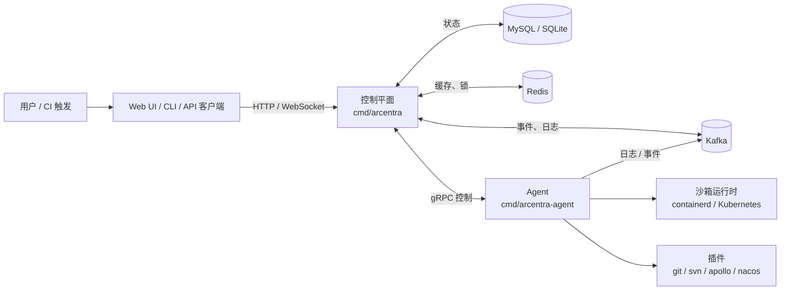

Arcentra 由两个长期运行的服务以及一个共享库层组成：

- **控制平面**（`cmd/arcentra`）：负责流水线、运行实例、身份、调度，以及对外
  的 HTTP / gRPC / WebSocket 接口。
- **Agent**（`cmd/arcentra-agent`）：连接控制平面，拉取并执行步骤运行
  （StepRun），在沙箱或宿主机上完成执行，并回传状态、日志与产物。
- **共享运行时**（`internal/shared/...`）：流水线编排、DSL、builtin、执行器、
  通知、存储与 gRPC 客户端/拦截器，控制平面和 Agent 共用。

## 组件全景

## 控制平面

控制平面由
[`internal/control/bootstrap`](https://github.com/arcentrix/arcentra/tree/main/internal/control/bootstrap)
启动，读取两个配置文件（`-conf` 与 `-plugin-conf`），对外提供：

- **HTTP API**：流水线、运行、身份、设置、上传以及 WebSocket 网关，默认
  `:8080`。
- **gRPC 服务**：Agent 控制、Gateway 数据接收、Pipeline、StepRun 与
  Stream，默认 `:9090`。
- **Metrics**：`:8082`，可选启用 OTLP 链路追踪。

状态存储在 SQL 数据库（生产推荐 MySQL）。Redis 提供缓存与短期协调；Kafka 在
数据面和控制面之间承载日志与事件。

## Agent

Agent 由
[`internal/agent/bootstrap`](https://github.com/arcentrix/arcentra/tree/main/internal/agent/bootstrap)
启动，读取一个配置文件，主要职责：

- 注册到控制平面并定期发送心跳。
- 按标签选择器与并发预算拉取需要执行的 StepRun。
- 在配置好的沙箱内执行 builtin（如 `shell`）与插件（如 `git`、`svn`、
  `apollo`、`nacos`）。
- 通过 gRPC 与 Kafka 回传状态、日志和产物。

Agent 适配多种环境：裸金属、containerd、Kubernetes Pod，或任何能够通过 gRPC
访问控制平面的主机。

## 流水线运行时

流水线运行时位于
[`internal/shared/pipeline`](https://github.com/arcentrix/arcentra/tree/main/internal/shared/pipeline)
，控制平面和 Agent 共用。核心概念：

- **Pipeline**：与项目绑定的版本化定义，可以内联存放，也可以由 Git 仓库中的
  `pipeline.yaml` 提供。
- **Stage / Job / Step**：流水线的结构分解。可以使用 `stages` 模式（
  `Stage → Jobs → Steps`），也可以使用 `jobs` 简写模式（自动包裹默认
  Stage）。
- **PipelineRun / JobRun / StepRun**：运行期对象，承载状态、日志、产物与时间
  线。
- **Trigger**：手动、Cron/调度，或事件/Webhook，可结合审批门控。
- **执行器与 builtin**：本地执行模型（`shell`、`stdout`、产物、报告、SCM
  等），以及通过 `uses + action + args` 调用的插件动作。

面向用户的模型与 HTTP 形态见 [流水线](/zh/pipelines)。

## 插件与可扩展性

插件通过二进制的 import 集合加载（见
[`cmd/arcentra/main.go`](https://github.com/arcentrix/arcentra/blob/main/cmd/arcentra/main.go)
），并通过 `conf.d/plugins.toml` 配置。仓库默认提供：

- **Git**、**SVN** 源代码检出。
- **Apollo**、**Nacos** 配置中心集成。

新的动作或集成可以遵循同样的接口模型，无需改动控制平面即可扩展。

## 可观测性与治理

- **指标**：通过指标端口暴露 Prometheus 格式数据。
- **链路**：基于 OpenTelemetry，支持 OTLP-gRPC / OTLP-HTTP / Jaeger 导出。
- **日志**：结构化日志，支持多 category（HTTP、插件、Cron 等）。
- **事件**：流水线与插件生命周期事件遵循 CloudEvents 兼容映射。

这些信号是审计、SLO 仪表盘以及跨团队治理的基础。
